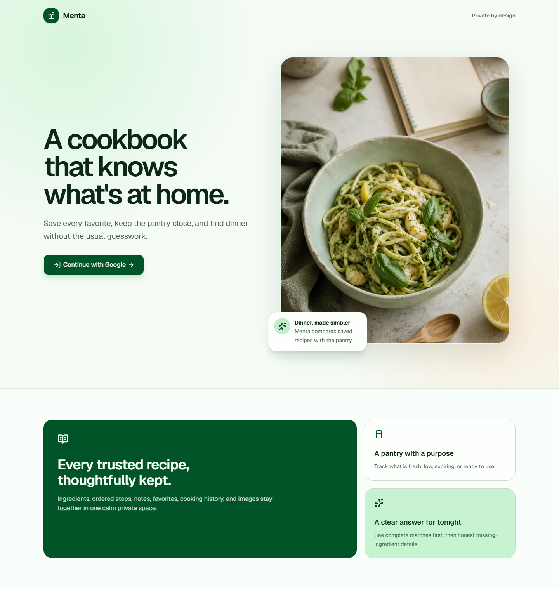
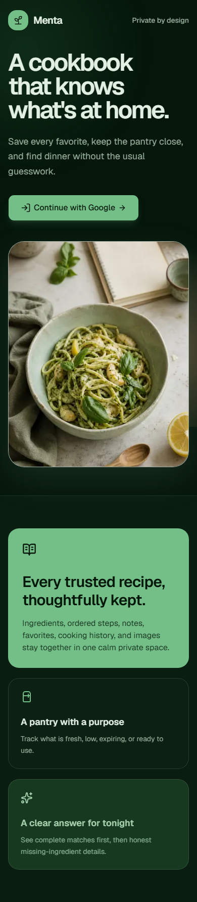
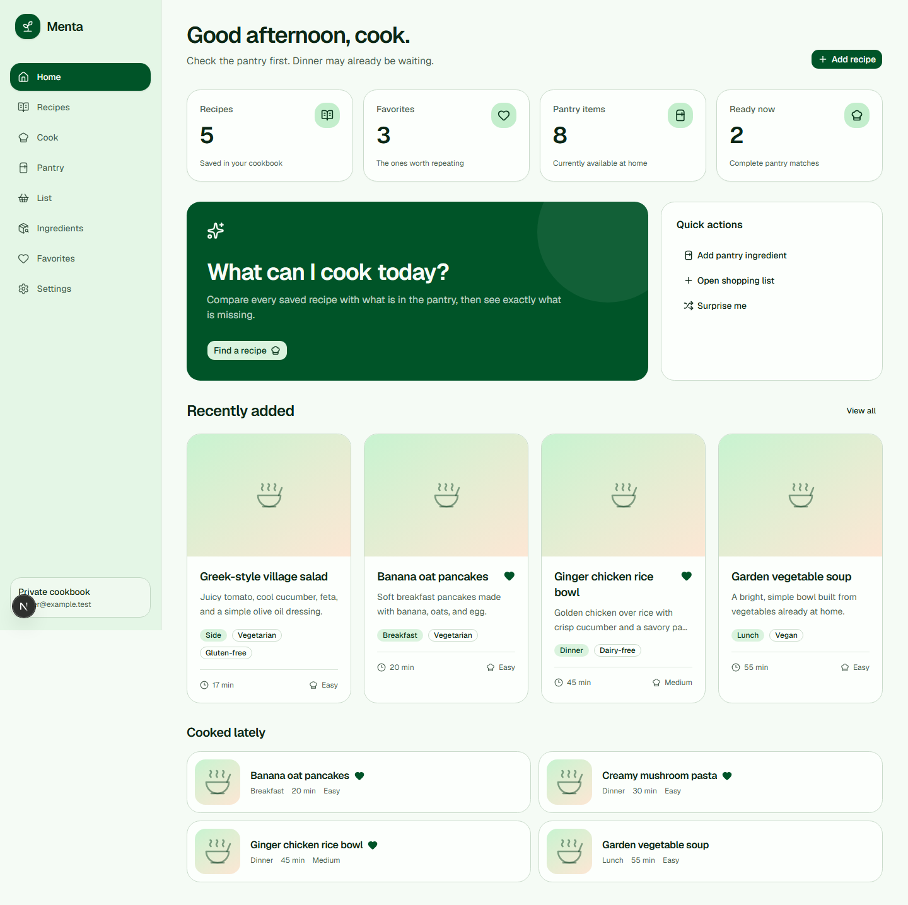
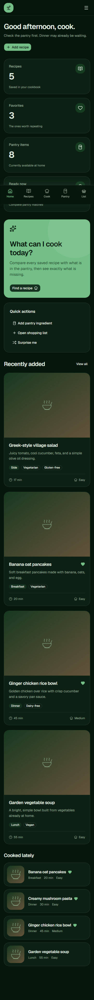
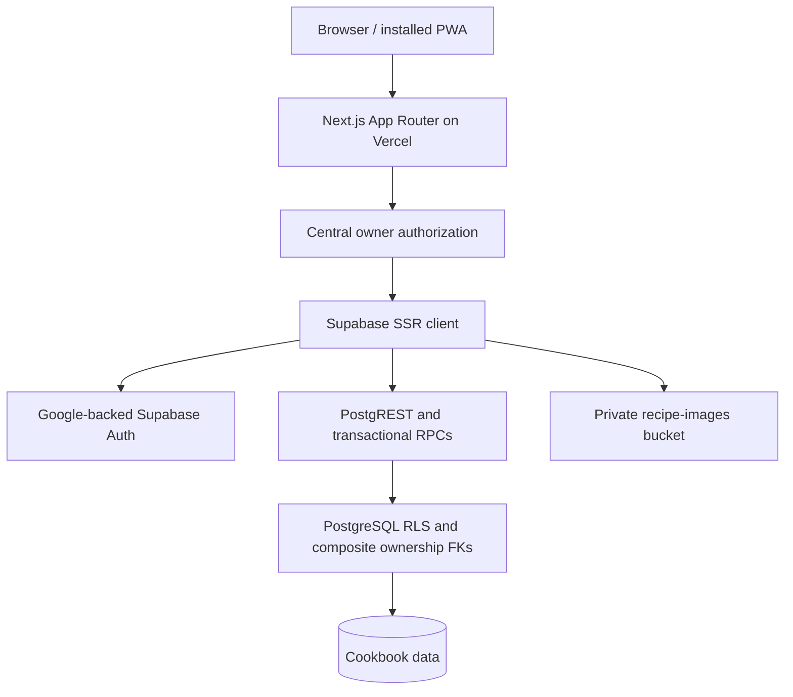

# Nana's Recipes

Nana's Recipes is a private digital cookbook for saving recipes, keeping a real pantry,
and deciding what to cook from ingredients already at home. Its interface uses
a calm mint-and-sage visual system, responsive navigation, a focused cooking
mode, and deliberately conservative ingredient/quantity logic.

The current release is owner-only: Google handles identity through Supabase
Auth, the server requires a signed Google provider claim plus the normalized
email in `OWNER_EMAIL`, and PostgreSQL RLS repeats that deployment gate before
isolating every user's rows. The data model remains multi-user so sharing can
be added later without weakening today's private boundary.

## Product highlights

- A useful dashboard with recipe, favorite, pantry, and ready-to-cook metrics;
  recent recipes; recent cooking history; quick actions; and “Surprise me.”
- Searchable recipe library with URL-backed filters, sorting, grid/list views,
  favorites, loading skeletons, and clear empty/no-result states.
- Full recipe editor with reusable ingredients, ordered ingredient/step rows,
  duplicate warnings, common/custom units, draft support, local autosave,
  unsaved-change protection, and validated cover-image upload progress.
- Recipe detail actions for serving scaling, temporary ingredient checklists,
  favorite, duplicate, mark cooked, pantry/shopping workflows, print, edit, and
  confirmed deletion.
- Mobile cooking mode with persisted progress, ingredient checklist, full-step
  view, simultaneous timers, optional notifications, wake-lock fallback, and
  completion logging.
- Pantry management with grouped locations, search, sorting, expiration states,
  quick quantity changes, depletion, and five-row grocery fast entry.
- Deterministic “What can I cook?” ranking with selected/manual/excluded
  ingredients, staple handling, filters, exact explanations, conservative
  quantity comparisons, and explicit substitutions only.
- Shopping list with manual and recipe-derived items, exact-unit duplicate
  merging, checked/unchecked groups, shopping mode, clear-completed, and an
  atomic move-to-pantry workflow.
- Owner-managed ingredient catalog with aliases, accent-preserving identity,
  categories, staples, safe deletion constraints, and transactional merging.
- Settings for Google profile, theme, reduced motion, servings, measurement
  preference, staples, versioned JSON export, sign-out, and strongly confirmed
  cookbook deletion.
- Installable PWA metadata and a safe offline fallback that caches only public
  static assets—not authenticated HTML, private APIs, or recipe images.

Dietary labels are organizational metadata, not allergy or medical-safety
guarantees. Nana's Recipes never invents substitutions or converts incompatible culinary
units such as cups to grams.

## Screenshots

These captures come from the running application, not design mockups:

| Desktop landing                                                               | Mobile dark mode                                                                              |
| ----------------------------------------------------------------------------- | --------------------------------------------------------------------------------------------- |
|  |  |

| Desktop dashboard                                                            | Mobile dashboard dark mode                                                                   |
| ---------------------------------------------------------------------------- | -------------------------------------------------------------------------------------------- |
|  |  |

When the interface changes, recapture the running site at a desktop viewport
and a common phone viewport, preserve both light/dark coverage, and replace the
files above. Do not substitute Figma frames or static mockups for verification
captures.

## Technology

| Layer                | Implementation                                                             |
| -------------------- | -------------------------------------------------------------------------- |
| Web                  | Next.js 16 App Router, React 19, strict TypeScript                         |
| UI                   | Tailwind CSS 4, Radix/shadcn-style primitives, Lucide, Sonner, next-themes |
| Forms and validation | React Hook Form and Zod 4 at client and server boundaries                  |
| Data                 | Supabase PostgreSQL, generated-style database types, transactional RPCs    |
| Auth                 | Google OAuth through Supabase, `@supabase/ssr`, PKCE callback cookies      |
| Files                | Private Supabase Storage with owner-namespaced image paths                 |
| Tests                | Vitest, Testing Library, SQL integration smoke tests, Playwright           |
| Delivery             | pnpm lockfile, ESLint, Prettier, Vercel-compatible Next.js build           |

The locked dependency versions in `package.json` and `pnpm-lock.yaml` are the
actual build contract.

## Architecture



- Server Components load private data by default. Client Components are used
  only for editors, filters, timers, local session state, and similar
  interaction.
- Server Actions and Route Handlers call `requireOwner()` and validate input
  with Zod before mutations. The client never supplies a trusted owner ID.
- Multi-table recipe, pantry, shopping, merge, export/import-compatibility, and
  reset workflows are atomic PostgreSQL RPCs running as `SECURITY INVOKER`.
- RLS and composite foreign keys prevent cross-owner rows even if application
  authorization regresses. The browser uses only the publishable/anon key.
- Images are stored as private object paths. Authenticated reads use short-lived
  access, while uploads validate size, MIME, extension, and byte signature.
- Private responses are not placed in shared caches. The service worker caches
  only versioned framework assets and explicitly public artwork.

Important locations:

```text
src/app/                    routes, layouts, errors, manifest, API handlers
src/features/               feature actions and interactive components
src/lib/auth/               centralized authorization and OAuth actions
src/lib/data/               server queries, export adapter, demo test fixtures
src/lib/domain/             ingredient identity, matching, quantities
src/lib/supabase/           browser, server, and proxy clients
src/lib/validation/         Zod mutation and export contracts
src/types/                  application and Supabase database types
supabase/migrations/        schema, RLS/storage, and transactional RPCs
supabase/seed.sql           optional idempotent local development data
tests/unit/                 domain, validation, auth, export, and upload tests
tests/integration/          SQL RLS/RPC smoke test
e2e/                        critical browser flows with safe test-only auth
docs/                       database, authentication, and deployment guides
```

## Database model

Every public data table carries `user_id`. Recipe ingredients, steps, tags,
images, history, and share metadata also use composite ownership foreign keys
to their parent rows. Core aggregates include:

- profiles and typed user preferences;
- recipes, ordered ingredients and steps, tags, and private image metadata;
- canonical ingredients and directional substitution metadata;
- pantry lots, shopping items, and cooking history;
- future-facing share metadata that remains owner-only under current RLS.

Migrations 001–008 create the complete schema, indexes, triggers, RLS policies,
private Storage bucket, recipe/search workflows, pantry/catalog workflows,
shopping upsert, settings/export, and the strict database owner gate. See
[Database architecture](docs/database.md) for the full ER model, RPC semantics,
delete behavior, export envelope, and migration workflow.

## Authentication and owner-only access

The protection layers have different jobs:

1. Google OAuth proves the account identity through Supabase Auth.
2. The callback and every protected server boundary require Google in signed
   provider metadata and compare the normalized verified email with server-only
   `OWNER_EMAIL`.
3. Supabase SSR refreshes cookie-backed claims.
4. PostgreSQL RLS requires the same Google claim, the configured database owner
   email, and `auth.uid()` ownership on every row/object.

A different authenticated Google account receives the polished `/private`
page and can sign out; it cannot read the owner's data through PostgREST. Safe
relative `next` redirects are preserved without accepting external redirect
targets.

Google and Supabase use two different callbacks. Configure them precisely by
following [Authentication and owner authorization](docs/authentication.md).

## Prerequisites

- Node.js 20 LTS or newer.
- pnpm (Corepack is suitable).
- Docker Desktop for the local Supabase stack and database integration tests.
- A Supabase project and Google Cloud OAuth web client for real login.

## Local setup

### 1. Install dependencies

```bash
corepack enable
pnpm install --frozen-lockfile
```

### 2. Create local environment configuration

On PowerShell:

```powershell
Copy-Item .env.example .env.local
```

Fill `.env.local` with either a hosted Supabase project's public settings or
the values printed by `pnpm dlx supabase status`:

```dotenv
NEXT_PUBLIC_SUPABASE_URL=http://127.0.0.1:54321
NEXT_PUBLIC_SUPABASE_ANON_KEY=<local-publishable-or-anon-key>
NEXT_PUBLIC_SITE_URL=http://localhost:3000
OWNER_EMAIL=owner@example.com
E2E_TEST_MODE=0
```

Do not commit `.env.local`. Nana's Recipes does not require a service-role key.

### 3. Start and verify local Supabase

The repository already contains `supabase/config.toml` and all migrations:

```bash
pnpm dlx supabase start
pnpm dlx supabase db reset --local
pnpm test:db
```

`db reset --local` rebuilds only the local database. `test:db` bootstraps its
own deterministic local test identity and seed, then verifies RLS owner/other
user isolation, search, export, settings, and an atomic recipe transaction. It
requires exactly one running local `supabase_db_*` container.

The configured reset invokes `supabase/seed.sql`, but the seed safely skips
when no local Auth profile exists. The database smoke script handles its own
test data independently.

### 4. Optional browsing/demo data

For realistic data under a local user:

1. Configure the local Google provider as described in
   [authentication.md](docs/authentication.md), then sign in to Nana's Recipes once with
   the intended Google account. Do not use Studio's Email-user creation form;
   Nana's Recipes intentionally rejects non-Google identities.
2. Open local Studio, normally <http://127.0.0.1:54323>.
3. In Studio's SQL editor, configure that same Google email. This reruns the
   profile trigger for the existing Google-backed Auth user:

   ```sql
   select private.configure_owner_email('owner@example.test');
   ```

4. Run the seed for the oldest local profile, or select a UUID explicitly:

   ```bash
   pnpm db:seed
   pnpm db:seed -- --user <local-auth-user-uuid>
   ```

The wrapper discovers the local Supabase PostgreSQL container, refuses remote
connections, and never uses a service-role key. The seed is idempotent and adds
five complete recipes, a normalized catalog, pantry matching cases, staples,
an expiring item, an incompatible-unit case, tags, and cooking history.

Useful seed diagnostics:

```bash
pnpm db:seed -- --dry-run
pnpm db:seed -- --help
```

### 5. Run the app

```bash
pnpm dev
```

Open <http://localhost:3000>. Real Google login requires the provider and both
callback allowlists described in [authentication.md](docs/authentication.md).
For UI-only development, the automated Playwright flow supplies a separate
test-only identity and deterministic demo records.

## Hosted Supabase setup

1. Create a project in Supabase and copy its Project URL and publishable/anon
   key.
2. Apply the versioned migrations with the CLI:

   ```bash
   pnpm dlx supabase login
   pnpm dlx supabase link --project-ref <project-ref>
   pnpm dlx supabase migration list
   pnpm dlx supabase db push
   pnpm dlx supabase migration list
   ```

3. Do **not** pass `--include-seed`; development recipes must not be seeded into
   production.
4. In the Supabase SQL editor, configure the same normalized address used for
   `OWNER_EMAIL`:

   ```sql
   select private.configure_owner_email('owner@example.com');
   ```

   This admin-only function also backfills profile/preferences if that Auth
   user already exists. Rerun it deliberately when changing the owner.

5. Verify that migration 002 created a **private** `recipe-images` bucket and
   owner-only object policies. Do not replace it with a public bucket.
6. In Supabase Authentication -> Providers, enable Google and disable Email
   sign-ins/signups. Then configure the Site URL and redirect allowlist from
   [authentication.md](docs/authentication.md). Nana's Recipes also verifies the signed
   Google provider claim in Next.js and PostgreSQL, so an Email-provider token
   cannot enter even if dashboard settings drift later.
7. Put the hosted URL/key and intended owner email in `.env.local` or Vercel.

Do not make schema changes directly in the hosted Table Editor after adopting
these migrations. Add a forward-only migration, reset/test locally, then run
`db push`.

## Environment variables

| Variable                        | Exposure            | Required behavior                                                                                                        |
| ------------------------------- | ------------------- | ------------------------------------------------------------------------------------------------------------------------ |
| `NEXT_PUBLIC_SUPABASE_URL`      | Browser-safe        | URL of the same Supabase project as the key                                                                              |
| `NEXT_PUBLIC_SUPABASE_ANON_KEY` | Browser-safe        | Publishable/anon key; security depends on the checked-in RLS policies                                                    |
| `NEXT_PUBLIC_SITE_URL`          | Browser-safe origin | `http://localhost:3000` locally; exact canonical HTTPS origin in production; usually omitted for dynamic Vercel Previews |
| `OWNER_EMAIL`                   | Server-only         | Exact Google email allowed into this deployment; must match `private.configure_owner_email(...)`                         |
| `E2E_TEST_MODE`                 | Local tests only    | Keep `0`/unset normally and never configure it in any Vercel environment                                                 |

`NEXT_PUBLIC_SITE_URL` contains an origin only, without `/auth/callback`. Nana's Recipes
constructs that path itself and falls back to Vercel's deployment URL for
Preview when the variable is absent.

## Commands

| Command             | Purpose                                                    |
| ------------------- | ---------------------------------------------------------- |
| `pnpm dev`          | Start the Next.js development server                       |
| `pnpm build`        | Create the production Next.js build                        |
| `pnpm start`        | Serve an existing production build                         |
| `pnpm lint`         | Run ESLint with zero warnings allowed                      |
| `pnpm typecheck`    | Run strict TypeScript without emitting files               |
| `pnpm test`         | Run the Vitest unit suite once                             |
| `pnpm test:watch`   | Run Vitest in watch mode                                   |
| `pnpm test:db`      | Bootstrap local test data and run SQL RLS/RPC smoke tests  |
| `pnpm test:e2e`     | Run critical Playwright flows with guarded local test auth |
| `pnpm format`       | Format the repository with Prettier                        |
| `pnpm format:check` | Check formatting without changing files                    |
| `pnpm db:seed`      | Apply optional data to an existing local Auth profile      |

## Testing strategy

Unit tests cover ingredient normalization and aliases, deterministic matching
and ranking, optional/garnish/staple/exclusion behavior, incompatible units,
quantity formatting and serving scaling, safe external URLs, owner-email
normalization, local-auth production guards, image signatures, recipe/pantry/
shopping/settings validation, and the strict export adapter.

The SQL integration test exercises the actual migrated PostgreSQL functions,
transactions, and RLS under owner and unrelated authenticated claims.
Playwright covers the browser interaction contracts for logged-out/protected/
denied/owner auth states, dashboard access, recipe create/edit/cook/delete
confirmation, pantry entry, matcher categories, and adding missing ingredients
to shopping. Its production-locked test mode uses deterministic demo reads and
mutation responses instead of writing Supabase; persistence and denial are
verified separately by the SQL suite and focused Server Action tests.

Run the release gate:

```bash
pnpm format:check
pnpm lint
pnpm typecheck
pnpm test
pnpm dlx supabase start
pnpm dlx supabase db reset --local
pnpm test:db
pnpm test:e2e
pnpm build
```

Real Google OAuth remains a manual check because automated credentials would
weaken the production boundary.

## Export and import status

`GET /api/export` is owner-protected, uncached, and validates the database
result against a strict camelCase `schemaVersion: 1`, `product: "Nana's Recipes"`
envelope before download. It contains ingredients, tags, nested recipes,
pantry, shopping, cooking history, and settings without Auth secrets or owner
IDs. Private image paths are metadata; image binaries require a separate
Storage backup.

Import is intentionally absent from the production UI. The database retains a
transactional current/legacy compatibility adapter, but no user-facing import
control is exposed until the complete flow has been validated against a hosted
Supabase project. Nana's Recipes never performs a partial client-side import. See the
exact envelope and limitations in [database.md](docs/database.md).

## Vercel deployment

The short path is:

1. Run the complete local release gate.
2. Link the production Supabase project, run `pnpm dlx supabase db push`
   without production seed data, then configure the database owner email.
3. Configure Google -> Supabase and Supabase -> Nana's Recipes callbacks.
4. Import the repository into Vercel and set the four application variables;
   never set `E2E_TEST_MODE` there.
5. Verify a Preview, accounting for its exact OAuth origin and database target.
6. Deploy a production-targeted build with `pnpm dlx vercel --prod`.
7. Verify owner/denied auth, CRUD, private images, matching, shopping transfer,
   export, and logs on the canonical production domain.

Preview redirects, environment targeting, exact CLI commands, rollback, and
troubleshooting are in [Deployment guide](docs/deployment.md).

## Production checklist

- [ ] Every release-gate command passes from the deploy commit.
- [ ] Hosted migration history includes 001 through 008.
- [ ] `private.configure_owner_email(...)` matches Vercel `OWNER_EMAIL`.
- [ ] `recipe-images` is private and all table/Storage RLS policies are active.
- [ ] Supabase Site URL and production callback are exact HTTPS URLs.
- [ ] Google has the exact application origin and Supabase Auth callback.
- [ ] Supabase Google Auth is enabled and Email/phone/anonymous providers are
      disabled.
- [ ] `OWNER_EMAIL` is server-only and matches the intended Google account.
- [ ] URL/key pairs target the intended Supabase project in each environment.
- [ ] `E2E_TEST_MODE`, service-role keys, Google secrets, and DB passwords are
      absent from Vercel application variables and Git.
- [ ] Owner, logged-out, denied-account, logout, and expired-session paths work.
- [ ] Private image upload/read/replace/delete and JSON export work.
- [ ] Preview testing cannot accidentally damage production owner data.
- [ ] Vercel logs contain no tokens, cookies, OAuth codes, or raw DB errors.
- [ ] Production import UI remains unavailable.

## Security notes

- Authorization is repeated at server read/mutation boundaries and enforced
  again by RLS; client-side visibility is never trusted.
- The public Supabase key is not a bypass key. No service-role client exists in
  the application.
- Mutation inputs and export output are schema-validated. User text is rendered
  as text, and source URLs accept safe HTTP(S) values only.
- Image paths are collision-resistant and owner-prefixed; the bucket is private.
- Security headers include CSP, frame denial, MIME sniffing protection, a strict
  referrer policy, and a restricted Permissions Policy.
- The PWA deliberately avoids caching private responses on shared devices.
- Recipe visibility/share rows are future-facing metadata; current RLS remains
  owner-only regardless of those values.

## Troubleshooting

### Nana's Recipes says Supabase configuration is missing

Copy `.env.example` to `.env.local`, use a valid URL, and use the matching
publishable/anon key. Restart `pnpm dev` after changing public variables.

### `pnpm test:db` cannot find the database

Start Docker Desktop and run `pnpm dlx supabase start`. The test intentionally
requires exactly one running `supabase_db_*` container; stop other local
Supabase projects if several are detected.

### `pnpm db:seed` says no profile exists

Complete a local Google sign-in first, then configure its email with
`private.configure_owner_email(...)`. Do not create an Email-provider user in
Studio because Nana's Recipes' signed-provider gate will correctly refuse it. Then
retry, optionally with `--user <uuid>`. Resetting the database deletes local
users and therefore requires another local Google sign-in.

### Google reports `redirect_uri_mismatch`

Google needs the Supabase Auth callback, while Supabase needs Nana's Recipes'
`/auth/callback`. Compare both against
[authentication.md](docs/authentication.md) character-for-character.

### The owner sees “This cookbook is private”

Check the environment-specific `OWNER_EMAIL`, hidden whitespace, the email
Google returned, and whether the session's signed provider metadata contains
Google. Vercel environment changes require a new deployment.

### A table or RPC is missing

Run `pnpm dlx supabase migration list` for the linked project and apply every
migration through 008 before deploying the corresponding code.

### Image upload fails

Verify the private bucket/policies, owner session, and a genuine JPEG/PNG/WebP
no larger than 6 MiB whose extension matches its MIME type and file signature.

## Known limitations

- The product is intentionally owner-only. Sharing and public visibility have
  schema foundations but no recipient policies or UI.
- Import is not exposed in production pending hosted end-to-end validation.
- JSON export does not contain private image bytes, Auth/profile data, share
  grants, or ingredient-substitution relationships.
- Offline support is a safe fallback and installable shell, not offline access
  to private recipes or queued mutations.
- Explicit substitutions can influence matching when stored, but there is not
  yet a first-class substitution editor.
- Arbitrary Vercel Preview domains cannot be wildcarded in Google Authorized
  JavaScript origins; use an exact stable preview domain for real preview login.

## Future enhancements

- Deliberate recipient RLS and private recipe sharing.
- A hosted-verified transactional import experience with dry-run reporting.
- A combined structured-data and private-image backup archive.
- Household pantry collaboration with explicit membership roles.
- A first-class directional substitution editor and safety notes.
- Optional URL import or assisted authoring behind the same validation and
  ownership boundaries.
