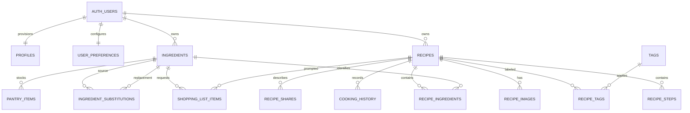

# Database architecture

The cookbook uses Supabase PostgreSQL for structured data and a private
Supabase Storage bucket for recipe images. The schema is multi-user at the data
layer, while the application currently admits only the Google account matching
the server-only `OWNER_EMAIL` environment variable.

The SQL migrations are authoritative:

| Migration                                       | Responsibility                                                                       |
| ----------------------------------------------- | ------------------------------------------------------------------------------------ |
| `202607150001_initial_schema.sql`               | Extensions, enums, tables, indexes, integrity triggers, profile provisioning         |
| `202607150002_rls_and_storage.sql`              | Owner-isolated RLS, table grants, private `recipe-images` bucket and object policies |
| `202607150003_recipe_rpcs.sql`                  | Transactional recipe aggregates, cooking history, owner-scoped recipe search         |
| `202607150004_cookbook_workflows.sql`           | App payload adapters, duplication, pantry/shopping workflows, export/import/delete   |
| `202607150005_pantry_and_catalog_rpcs.sql`      | Pantry fast entry and careful ingredient merging                                     |
| `202607150006_shopping_rpc.sql`                 | Owner-derived shopping-item create/edit and exact-unit duplicate merging             |
| `202607150007_settings_and_export_contract.sql` | Typed settings plus the versioned camelCase export/import contract                   |
| `202607150008_strict_owner_gate.sql`            | Database owner allowlist, staple sync, and transactional recipe/image deletion       |

[`src/types/database.ts`](../src/types/database.ts) mirrors this contract in the
generated Supabase `Database` format.

## Core decisions

- Every public application table has a `user_id`. On `profiles`, both `id` and
  `user_id` equal the corresponding `auth.users.id`.
- UUID primary keys and composite ownership foreign keys make cross-user child
  relationships invalid even below the RLS layer.
- PostgreSQL `numeric` stores quantities and servings. The chosen unit remains
  text; no database code invents conversions between incompatible units.
- Ingredient identity uses the accent-preserving `normalized_name`. Search uses
  the separate accent-insensitive `search_key(text)` function.
- Recipe aggregate writes and multi-table workflows are one PostgreSQL
  transaction per RPC call.
- Image records store private object paths, never public or signed URLs.
- Substitutions are explicit, directional records with optional unit context and
  safety wording. Their existence is not a dietary or allergy guarantee.

## Relationship map



Every relationship row also carries the same owner `user_id`. Public-table
relationships use composite foreign keys such as
`(user_id, recipe_id) -> recipes(user_id, id)`.

## Enums

| Enum                     | Values                                                                                                                                                              |
| ------------------------ | ------------------------------------------------------------------------------------------------------------------------------------------------------------------- |
| `recipe_status`          | `draft`, `published`                                                                                                                                                |
| `recipe_visibility`      | `private`, `shared`, `public`                                                                                                                                       |
| `recipe_difficulty`      | `easy`, `medium`, `challenging`                                                                                                                                     |
| `ingredient_category`    | `produce`, `meat`, `seafood`, `dairy`, `eggs`, `grains`, `pasta`, `baking`, `spices`, `herbs`, `condiments`, `oils`, `canned_goods`, `frozen`, `beverages`, `other` |
| `storage_location`       | `fridge`, `freezer`, `pantry`, `counter`, `other`                                                                                                                   |
| `tag_type`               | `dietary`, `custom`                                                                                                                                                 |
| `image_kind`             | `cover`, `gallery`                                                                                                                                                  |
| `theme_preference`       | `light`, `dark`, `system`                                                                                                                                           |
| `measurement_preference` | `metric`, `imperial`, `original`                                                                                                                                    |
| `share_permission`       | `view`, `edit`                                                                                                                                                      |

Recipe category is constrained text rather than a PostgreSQL enum. Its allowed
values are `breakfast`, `lunch`, `dinner`, `snack`, `dessert`, `side`, `drink`,
and `other`.

## Tables

### `profiles`

One row per Auth user. It stores normalized email, display name, avatar URL, and
timestamps. `profiles_user_identity` requires `id = user_id`; both columns
reference `auth.users` and cascade when the Auth user is deleted.

The Auth trigger creates or refreshes the profile from Google metadata and
ensures a matching preferences row exists. Profile fields are presentation
data, not a substitute for a verified session.

### `user_preferences`

One row per user with `theme`, integer `default_servings`,
`measurement_preference`, `ignore_staples_by_default`, selected
`staple_ingredient_ids`, normalized `additional_staple_names`, and
`reduce_motion`. The table accepts servings from 1 through 1000; the
app-facing settings RPC deliberately narrows this to 1 through 100. Staple ID
and additional-name arrays are capped at 500 and 100 entries, respectively.
`id` is an ordinary UUID primary key; `user_id` has a unique constraint.

### `recipes`

The recipe aggregate root contains title, nullable slug and description, cover
`image_path`, constrained category, optional cuisine and difficulty, three
non-null time components, non-null servings, source information, notes,
favorite state, status, visibility, cooking statistics, revision, and
timestamps. Category defaults to `other`, each time component defaults to
zero, and servings defaults to 2.

Two columns are generated and cannot be written directly:

- `total_minutes` is the sum of prep, cook, and rest minutes.
- `search_document` is a `tsvector` built from title, description, category,
  and cuisine using the accent-insensitive search key.

Every update increments `revision` and refreshes `updated_at`. The lower-level
update RPC can compare a supplied revision and raises a serialization-style
error if the recipe changed after the editor loaded it.

`visibility` is future-facing metadata only. In the current migration set,
`shared` and `public` do not make a recipe readable by anyone else.

### `ingredients`

The user-owned canonical catalog stores `canonical_name`, optional
`display_name`, conservative `normalized_name`, category, default unit, aliases,
staple status, notes, and timestamps. `(user_id, normalized_name)` is unique.
Aliases are capped at 50 entries and have a GIN index.

Normalization lowercases and collapses whitespace but preserves accents. The
separate `search_key` wrapper lowercases and removes accents for search only,
avoiding aggressive identity merges.

### `ingredient_substitutions`

A directional record from `ingredient_id` to `substitute_ingredient_id`. It
stores a positive `quantity_multiplier`, optional `source_unit` and
`substitute_unit`, notes, and `safety_warning`. The two ingredient IDs must be
different and belong to the same owner. Direction uniqueness includes both
units; a reverse substitution requires its own row.

### `recipe_ingredients`

Ordered ingredient lines reference a canonical ingredient while preserving
recipe-specific `display_name`, quantity, unit, preparation note, section,
optional state, and garnish state. Optional ingredients do not reduce the core
matcher score; garnishes can be weighted below required lines. Quantity is
nullable for wording such as “to taste.” `sort_order` is unique per recipe.

### `recipe_steps`

Ordered instructions with an optional positive timer of at most seven days and
an optional private `image_path`. `sort_order` is unique per recipe.

### `tags` and `recipe_tags`

Tags are either `dietary` or `custom` and are unique per
`(user_id, type, normalized_name)`. The join has its own UUID, user ID, and
creation time. Composite foreign keys ensure both its recipe and tag have the
same owner.

Dietary tags are organizational labels, not medical-safety claims.

### `recipe_images`

Private cover/gallery metadata: owner, recipe, `storage_path`, kind, alt text,
order, and timestamps. A recipe can have one cover; gallery ordering is unique.
Cover insert/update/delete triggers synchronize `recipes.image_path`.

Step images are not rows in this table; their paths live on `recipe_steps`.

### `pantry_items`

Stock lots link to canonical ingredients and store nullable quantity/unit,
location, expiration date, low-stock state, depleted state, `depleted_at`,
notes, and timestamps. A trigger sets or clears `depleted_at` with
`is_depleted`. Multiple lots of an ingredient are allowed.

Expired and expiring-soon states are computed from `expiration_date` rather than
persisted as flags that could become stale.

### `shopping_list_items`

Each row has either an `ingredient_id` or a trimmed `custom_name`, never both.
It may reference a source recipe and includes nullable quantity/unit, notes,
and completion state. Notes are capped at 500 characters. A trigger keeps
`completed_at` consistent with `is_completed`.

If a recipe is deleted, only `recipe_id` becomes null and the shopping entry is
retained. Ingredient deletion is restricted while referenced.

### `cooking_history`

Appendable cooking sessions with recipe, time, optional servings, and notes.
Insert/update/delete triggers recompute `recipes.cooked_count` and
`last_cooked_at`, keeping cached dashboard values consistent.

### `recipe_shares`

Future-facing owner metadata with a recipe, optional recipient user, optional
normalized recipient email, permission, acceptance time, and timestamps. The
recipient check requires at least one recipient identifier and rejects sharing
with the owner by user ID.

The current RLS policy is deliberately owner-only. Recipients cannot read these
grants or recipes yet; changing `visibility` or inserting a share row does not
activate sharing.

## Row-level security

RLS is enabled on all 14 public data tables. `anon` has no table privileges;
authenticated users receive CRUD privileges subject to policy checks. The
migrations do not use permissive `using (true)` policies.

| Table group                             | RLS condition                                            |
| --------------------------------------- | -------------------------------------------------------- |
| `profiles`                              | `user_id = auth.uid()` and `id = auth.uid()`             |
| Preferences, recipes, ingredients, tags | Direct `user_id = auth.uid()` ownership                  |
| Ingredient substitutions                | Caller owns the row and both ingredient endpoints        |
| Recipe ingredients                      | Caller owns the row, parent recipe, and ingredient       |
| Recipe steps/images/history             | Caller owns the row and parent recipe                    |
| Recipe tags                             | Caller owns the row, recipe, and tag                     |
| Pantry items                            | Caller owns the row and ingredient                       |
| Shopping items                          | Caller owns the row and any referenced ingredient/recipe |
| Recipe shares                           | Recipe owner only; no recipient or public read policy    |

Every row above is also subject to migration 008's restrictive
`private.is_app_owner()` policy. PostgreSQL combines it with the detailed
ownership policy using AND, so an authenticated non-owner cannot create a
separate namespace or upload to `recipe-images`. The helper also requires
Google in the JWT's signed `app_metadata.provider/providers`; matching the
allowlist with an Email-provider token is insufficient.

Composite foreign keys independently reject cross-owner relationships.
`WITH CHECK` mirrors ownership rules for inserts and updates, so a caller cannot
reassign a row to another identity.

PostgreSQL cannot read Vercel's `OWNER_EMAIL`, so the project administrator runs
`select private.configure_owner_email('owner@example.com');` once after the
migrations. The private table is inaccessible to `anon` and `authenticated`;
its boolean policy helper compares the signed JWT email. This value must match
the server-only environment variable, and the JWT must identify Google as a
provider. Never expose `OWNER_EMAIL` or a service-role key through a
`NEXT_PUBLIC_*` variable.

## RPC security model

All public application RPCs in migrations `003` through `008` are
`SECURITY INVOKER` with an empty fixed `search_path`. Consequently, they run
with the authenticated caller's rights and remain subject to the same RLS
policies as direct table operations. They derive the owner from `auth.uid()` via
`private.current_user_id()` and reject unauthenticated calls.

Execute permission is revoked from `public` and `anon` and granted only to
`authenticated`. Transactional does not mean privileged: each RPC call is one
atomic transaction, but it does not bypass RLS.

A small set of internal Auth/statistics/cover trigger functions is
`SECURITY DEFINER` because triggers must maintain derived data. Those functions
use a fixed empty `search_path` and are not app-facing mutation APIs.
Migration 008's `configure_owner_email` is a separate administrator-only
function; execute permission is revoked from application roles.

## Recipe and search RPCs

### `create_recipe_with_details`

```text
(p_recipe jsonb,
 p_ingredients jsonb = [],
 p_steps jsonb = [],
 p_tags jsonb = [],
 p_images jsonb = []) -> uuid
```

Creates the scalar recipe and all ordered children atomically. Ingredient/tag
objects may reference an existing owned ID or provide data for conservative
catalog resolution. Child ownership and image path prefixes are verified.

### `update_recipe_with_details`

```text
(p_recipe_id uuid,
 p_recipe jsonb,
 p_ingredients jsonb = null,
 p_steps jsonb = null,
 p_tags jsonb = null,
 p_images jsonb = null) -> uuid
```

Locks the owned recipe and updates only scalar keys present in `p_recipe`.
Supplying `revision` enables optimistic-concurrency validation.

Child collection semantics are important:

- `null` or an omitted child argument preserves that collection;
- an empty JSON array clears that collection;
- a non-empty JSON array replaces that collection after full validation.

The function validates all collections before deleting/replacing children, and
the transaction rolls back on any error.

### App-facing `create_recipe` and `update_recipe`

```text
create_recipe(p_recipe jsonb) -> uuid
update_recipe(p_recipe_id uuid, p_recipe jsonb) -> uuid
```

These adapters accept the application's camelCase payload (`imagePath`,
`prepMinutes`, `dietaryTags`, `customTags`, and nested `ingredients`/`steps`)
and call the detailed RPCs. They are full-form aggregate operations:
`update_recipe` converts missing nested collections to empty arrays, so callers
must submit the complete ingredient and step collections. Use
`update_recipe_with_details` with null child arguments for a scalar-only patch.

### `duplicate_recipe`

```text
(p_recipe_id uuid) -> uuid
```

Copies owned scalar data, ingredient lines, steps, and tags into a private draft
named “(copy).” Image metadata and paths are intentionally not duplicated, so
the two recipes never alias the same Storage object.

### `mark_recipe_cooked`

```text
(p_recipe_id uuid, p_servings numeric = null, p_notes text = null) -> uuid
```

Creates a cooking-history row and returns its ID. The history trigger updates
the recipe statistics in the same transaction.

### `search_recipes`

```text
(p_query text = null,
 p_favorite boolean = null,
 p_category text = null,
 p_cuisine text = null,
 p_difficulty recipe_difficulty = null,
 p_dietary_tag text = null,
 p_max_prep_minutes integer = null,
 p_max_total_minutes integer = null,
 p_sort text = 'newest',
 p_limit integer = 24,
 p_offset integer = 0) -> setof recipe_search_row
```

Search is owner-scoped and covers recipe text, cuisine, canonical/display
ingredient names, aliases, and tags. Dietary filtering checks dietary tags.
Supported sorts are `newest`, `oldest`, `alphabetical`, `recently_cooked`,
`most_cooked`, and `shortest`. The limit is clamped to 1–100, offset is
non-negative, and each row includes a windowed `total_count`.

## Pantry, shopping, and catalog RPCs

### `add_recipe_ingredients_to_pantry`

```text
(p_recipe_id uuid, p_location storage_location = 'pantry') -> integer
```

Adds every recipe ingredient. It combines a non-depleted pantry row only when
ingredient, location, and exact unit match; otherwise it creates a new row.

### `add_recipe_missing_to_shopping`

```text
(p_recipe_id uuid, p_ingredient_ids uuid[] = null) -> integer
```

With explicit IDs, adds those owned recipe ingredients. With null IDs, adds
required, non-garnish ingredients absent from non-depleted pantry stock. The
preference to ignore staples is honored. Compatible incomplete shopping rows
are linked/updated idempotently without converting units.

### `upsert_shopping_item`

```text
(p_item jsonb) -> uuid
```

Creates or edits an owned shopping item from snake_case or camelCase identity
fields. An item must resolve to either an owned ingredient or a non-empty
custom name. New active duplicates merge only when the ingredient/custom-name
identity and unit match exactly; known quantities are added without unit
conversion. Editing by ID updates only an owned row. Optional recipe links are
ownership-checked, and notes are preserved or updated with the item.

### `move_completed_shopping_to_pantry`

```text
(p_item_ids uuid[] = null,
 p_location storage_location = 'pantry') -> jsonb
```

Processes selected rows, or all owned rows when IDs are null. Incomplete rows
are counted as skipped. Each completed item is upserted into an exact-unit
pantry row before its shopping row is deleted. Any failure rolls back both
operations. The JSON response contains `moved` and `skipped` counts.

### `upsert_pantry_item` and `bulk_upsert_pantry_items`

```text
upsert_pantry_item(p_item jsonb) -> uuid
bulk_upsert_pantry_items(p_items jsonb) -> uuid[]
```

The single-item RPC creates or edits an owned pantry row and can resolve/create
an ingredient from snake_case or camelCase input. New input merges only into a
non-depleted row with the same ingredient, location, and exact unit. Quantities
are added without conversion; the earliest known expiration is retained.

Bulk upsert performs up to 200 items in one transaction and returns IDs in
input order. A bad item rolls back the entire batch.

### `merge_ingredients`

```text
(p_source_id uuid, p_target_id uuid) -> jsonb
```

Locks both owned ingredients in deterministic order, then repoints recipe,
pantry, shopping, and substitution references. Quantities combine only when
unit and relevant context match exactly. Conflicting substitution edges are
deduplicated, aliases/staple metadata are retained, and the source ingredient
is deleted last. Preferences replace any selected source staple ID with the
target (and pin staples inherited from an additional-name rule), so settings do
not retain stale UUIDs. The response reports moved row counts and both IDs.

## Settings RPC

### `save_user_settings`

```text
(p_settings jsonb) -> uuid
```

Atomically upserts the caller's typed preferences and returns the preferences
row ID. The camelCase payload supports `theme`, `defaultServings`,
`measurementPreference`, `stapleIngredientIds`, `additionalStapleNames`, and
`reduceMotion`. Missing scalar values use app defaults; the two staple arrays
must be JSON arrays when present. Default servings are limited to 1–100 here,
selected ingredient IDs must belong to the caller, and additional names are
lowercased, whitespace-normalized, deduplicated, and length-checked.

The same transaction synchronizes `ingredients.is_staple`: an owned ingredient
is a staple when its ID is selected or its normalized name matches an
additional staple name. This keeps matcher behavior and stored settings in
agreement.

## Export, import, and destructive reset

### `export_cookbook_data`

```text
() -> jsonb
```

Returns the strict owner-scoped, camelCase Nana's Recipes envelope below. Every array is
present, even when empty; nullable values remain JSON `null`.

```json
{
  "schemaVersion": 1,
  "product": "Nana's Recipes",
  "exportedAt": "2026-07-15T12:00:00Z",
  "ingredients": [
    {
      "id": "uuid",
      "canonicalName": "Tomato",
      "displayName": "Tomatoes",
      "normalizedName": "tomato",
      "category": "produce",
      "defaultUnit": "g",
      "aliases": [],
      "isStaple": false,
      "notes": null,
      "createdAt": "timestamp",
      "updatedAt": "timestamp"
    }
  ],
  "tags": [
    {
      "id": "uuid",
      "name": "Vegetarian",
      "normalizedName": "vegetarian",
      "type": "dietary",
      "createdAt": "timestamp"
    }
  ],
  "recipes": [
    {
      "id": "uuid",
      "title": "Recipe title",
      "description": null,
      "imagePath": null,
      "category": "dinner",
      "cuisine": null,
      "difficulty": null,
      "prepMinutes": 10,
      "cookMinutes": 20,
      "restMinutes": 0,
      "servings": 2,
      "sourceName": null,
      "sourceUrl": null,
      "notes": null,
      "isFavorite": false,
      "status": "draft",
      "cookedCount": 0,
      "lastCookedAt": null,
      "createdAt": "timestamp",
      "updatedAt": "timestamp",
      "ingredients": [
        {
          "id": "uuid",
          "ingredientId": "uuid",
          "canonicalName": "Tomato",
          "displayName": "Tomatoes",
          "quantity": 200,
          "unit": "g",
          "preparationNote": null,
          "isOptional": false,
          "isGarnish": false,
          "sectionName": null,
          "sortOrder": 0
        }
      ],
      "steps": [
        {
          "id": "uuid",
          "instruction": "Cook until tender.",
          "timerMinutes": 20,
          "imagePath": null,
          "sortOrder": 0
        }
      ],
      "tagIds": ["uuid"]
    }
  ],
  "pantryItems": [
    {
      "id": "uuid",
      "ingredientId": "uuid",
      "quantity": 2,
      "unit": "pcs",
      "storageLocation": "pantry",
      "expirationDate": null,
      "lowStock": false,
      "notes": null,
      "createdAt": "timestamp",
      "updatedAt": "timestamp"
    }
  ],
  "shoppingListItems": [
    {
      "id": "uuid",
      "ingredientId": "uuid",
      "customName": null,
      "quantity": 1,
      "unit": "pcs",
      "recipeId": "uuid",
      "isCompleted": false,
      "completedAt": null,
      "createdAt": "timestamp",
      "updatedAt": "timestamp"
    }
  ],
  "cookingHistory": [
    {
      "id": "uuid",
      "recipeId": "uuid",
      "cookedAt": "timestamp",
      "servings": 2,
      "notes": null
    }
  ],
  "settings": {
    "theme": "system",
    "defaultServings": 2,
    "measurementPreference": "original",
    "stapleIngredientIds": [],
    "additionalStapleNames": [],
    "reduceMotion": false
  }
}
```

The envelope intentionally omits owner IDs, profile/Auth data, recipe shares,
ingredient substitutions, generated search/revision fields, pantry depletion
internals, and shopping-item notes. Image paths are metadata only: Auth tokens,
secrets, signed URLs, and private Storage object bytes are never exported.

### `import_cookbook`

```text
(p_payload jsonb, p_mode text = 'merge') -> jsonb
```

The public adapter accepts either the current `schemaVersion: 1`,
`product: "Nana's Recipes"` envelope or the legacy relational `schema_version: 1`
backup shape. Current envelopes must include JSON arrays for `ingredients`,
`tags`, `recipes`, `pantryItems`, `shoppingListItems`, and `cookingHistory`;
recipe ingredients, steps, and tag IDs are nested within each recipe. Modes are
`merge` and `replace`.

After adapting the current envelope, the importer applies the same limits and
ownership rules to both formats: payload text is capped at 10 MiB, each known
relational collection at 10,000 rows, ingredients and tags are conservatively
resolved, and all recipe/catalog IDs are remapped to the caller. The complete
import is atomic. Replace mode invokes the owner-scoped reset first inside the
same transaction.

Image metadata and binaries are not restored: imported recipe cover and step
paths are stripped, and the result reports `images_skipped`. The current
envelope has no share or substitution collections, and those relationships are
not recreated from it. The profile remains Auth-owned; supported settings are
updated when provided, and staple IDs are re-derived from imported ingredient
flags.

Application code should validate the same strict shape with Zod before calling
the RPC so users receive friendly errors. Never implement import as a client
loop of unrelated inserts.

### `delete_all_cookbook_data`

```text
() -> jsonb
```

Deletes only the caller's cookbook relationships, recipes, catalog, pantry, and
shopping data, then resets preferences to defaults. It does not delete the
profile or Auth user. The response includes deleted counts and a deduplicated
`storage_paths_to_delete` list collected from recipe image metadata, the recipe
cover path, and step image paths. The authenticated application removes those
external Storage objects after the database commit.

## Private image storage

The migration creates a private `recipe-images` bucket with an 8 MiB object
limit and MIME allowlist for JPEG, PNG, and WebP. Application validation must
also check MIME, extension, and byte size before upload.

Every Storage policy requires:

- `bucket_id = 'recipe-images'`;
- the first object-path segment equals `auth.uid()`;
- `storage.objects.owner_id` equals the authenticated user ID.

Both of these shapes satisfy the current policy:

```text
<uid>/<random-uuid>.<ext>
<uid>/<recipe-id>/<random-uuid>.<ext>
```

Nested recipe folders are an organizational convention, not a policy
requirement. Database checks likewise require the path to start with
`<user_id>/`, reject `..` traversal segments, and cap length at 1024 characters.

Authenticated users may select, insert, update, and delete only objects in
their own prefix. Images are served through authenticated downloads or
short-lived signed URLs; signed URLs are never persisted.

Safe replacement order is: upload the new object, commit the new path, then
delete the old object. This prevents committed metadata from pointing to a
missing file.

## Indexes and integrity automation

The schema indexes ownership and common ordering/filter dimensions, including
recipe update/create/favorite/status/visibility/cooking state, pantry location
and expiration, shopping completion, cooking history, and both sides of child
relationships.

Search indexes include:

- GIN on `recipes.search_document`;
- trigram GIN on accent-insensitive title, cuisine, ingredient, and tag keys;
- GIN on ingredient aliases.

Triggers maintain mutable timestamps, recipe revision, pantry depletion time,
shopping completion time, cooking statistics, and the synchronized cover path.
Generated columns and trigger-derived values should be treated as read-only in
application forms.

## Delete behavior

- Deleting a recipe cascades ingredient lines, steps, tags, image metadata,
  cooking history, and share metadata.
- Shopping items keep their content and set only `recipe_id` to null.
- Ingredient deletion is restricted while recipe, pantry, or shopping rows
  reference it; substitutions cascade with ingredient deletion.
- Deleting a tag removes its recipe joins.
- Deleting an Auth user cascades all owned rows.

Database cascades remove metadata, not Storage objects. Collect paths before a
destructive database operation and delete Storage objects only with the
authenticated owner session.

## TypeScript usage

```ts
import type { Database, Enums, Tables, TablesInsert } from "@/types/database";

type Recipe = Tables<"recipes">;
type PantryInsert = TablesInsert<"pantry_items">;
type Difficulty = Enums<"recipe_difficulty">;

// createServerClient<Database>(url, anonKey, cookieOptions)
```

After migrations are applied to a linked Supabase project, regenerate types:

```bash
supabase gen types typescript --linked > src/types/database.ts
```

Review generated-column types and relationship names, format the result, then
run type checking, database/RLS tests, and the production build.

## Migration workflow

1. Add a new forward-only migration; do not rewrite a production-applied file.
2. Reset a local Supabase database and apply the complete chain.
3. Test table and RPC access as the owner, an unrelated authenticated user, and
   an anonymous client.
4. Verify private Storage access for own and foreign prefixes.
5. Regenerate `src/types/database.ts` and inspect the drift.
6. Run application validation, integration tests, and a production build before
   applying to production.
