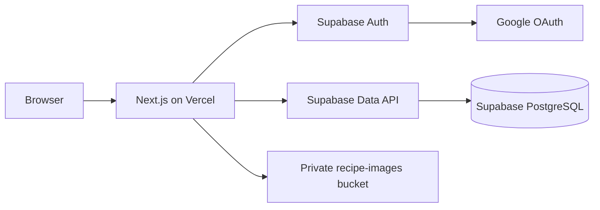

# Deployment guide

Nana's Recipes is designed for a hosted Supabase project and a Vercel-hosted Next.js
application. Deployment is a two-phase release: apply and verify the database
migrations first, then release the application that depends on them. No
`vercel.json` is required for the current single-project Next.js layout.

This guide does not imply that a deployment has already been created. Vercel,
Supabase, Google Cloud, DNS, and owner-account credentials are still manual
operator responsibilities.

## Release topology



The browser may receive only the Supabase URL and publishable/anon key. Google
client secrets live in Google/Supabase configuration, not Vercel. Nana's Recipes does
not need a service-role key for normal CRUD, export, seeding, or deployment.

## Prerequisites

- A Git repository containing this project and its committed `pnpm-lock.yaml`.
- Node.js 22 LTS or newer and pnpm 11.14.0.
- Docker Desktop for local Supabase verification.
- A Supabase project whose database password and project reference you control.
- A Google Cloud OAuth web client.
- A Vercel account, with a custom production domain if desired.

## 1. Verify the release locally

Install the locked dependencies and run the application checks:

```bash
pnpm install --frozen-lockfile
pnpm format:check
pnpm lint
pnpm typecheck
pnpm test
pnpm catalog:validate
pnpm service-worker:validate
pnpm test:e2e
pnpm build
```

Playwright starts an isolated development server on port 3210 and enables the
local-only test authentication boundary itself. It does not perform real
Google OAuth or persist its demo mutations to Supabase, and must never be run
with `E2E_TEST_MODE=1` on Vercel. The SQL integration suite below covers actual
transactional persistence and RLS; focused action tests cover failure/result
contracts.

Verify the complete migration chain and database security against local
Supabase:

```bash
pnpm exec supabase start
pnpm exec supabase db reset --local
pnpm test:db
pnpm exec supabase db lint --local --schema public,private --fail-on error
```

`test:db` creates a deterministic local-only Auth row, applies the idempotent
development seed, and runs `tests/integration/database-smoke.sql`. It checks
owner and unrelated-user RLS isolation, search, the strict export envelope,
settings persistence, transactional draft creation, and rejection of an
Email-provider token that uses the allowlisted address. It requires exactly one
local `supabase_db_*` container; stop other local Supabase projects if the
preflight reports more than one.

`db reset --local` is destructive only to the local project. Never point a
reset command at production.

## 2. Create and migrate the hosted Supabase project

Create a Supabase project, record its project reference, and copy its Project
URL plus publishable/anon key. Then link this checkout and inspect the pending
migrations:

```bash
pnpm exec supabase login
pnpm exec supabase link --project-ref <project-ref>
pnpm exec supabase migration list
pnpm exec supabase db push
pnpm exec supabase migration list
```

The ordered migrations under `supabase/migrations/` are authoritative. Apply
them in timestamp order through
`20260723172548_owner_health_invoker_storage_policy.sql`. Do not reproduce them manually
in the Dashboard, and do not use `db push --include-seed`: `supabase/seed.sql`
is realistic development data and must not populate production.

Configure the strict database gate from the Supabase SQL editor using the same
address that will be assigned to Vercel `OWNER_EMAIL`:

```sql
select private.configure_owner_email('owner@example.com');
```

This is deliberately an administrator-only function. Without this step, RLS
denies all application data and private image access by default.

Migration 002 creates the private `recipe-images` Storage bucket and its owner
policies. After the push, verify in Supabase Dashboard that:

- `recipe-images` exists and is private;
- its database object limit is 8 MiB with JPEG, PNG, and WebP allowed;
- Storage policies require the first path segment and object owner to match
  `auth.uid()`;
- RLS is enabled on every public user-data table;
- `anon` cannot read application tables or execute owner RPCs.
- an authenticated Google email outside `private.owner_allowlist` cannot create
  its own rows or use the Nana's Recipes image bucket;
- a non-Google token cannot pass the owner gate, even if its email matches.

The application applies a stricter 6 MiB upload limit and checks MIME type,
extension, and file signature before Storage upload.

Supabase's migration workflow is documented in
[Database Migrations](https://supabase.com/docs/guides/deployment/database-migrations).
The project-specific schema and policies are described in
[database.md](./database.md).

## 3. Configure Google and Supabase Auth

Follow [authentication.md](./authentication.md) completely. The production
values have two distinct callbacks:

```text
Google authorized redirect URI:
https://<project-ref>.supabase.co/auth/v1/callback

Supabase application redirect:
https://<production-domain>/auth/callback
```

In Supabase Authentication -> URL Configuration:

1. Set Site URL to the exact canonical production origin.
2. Add `http://localhost:3000/auth/callback` for local development if needed.
3. Add the exact production callback.
4. Add a narrow Vercel preview pattern only when preview login is required:

   ```text
   https://*-<team-or-account-slug>.vercel.app/**
   ```

In Google Cloud, add the exact production origin under Authorized JavaScript
origins. Arbitrary Vercel commit URLs cannot be represented by a Google
wildcard; use an exact stable branch/custom preview domain if preview Google
login is required. The Google redirect URI remains the Supabase callback.

In Supabase Authentication -> Providers, enable Google and disable Email
sign-ins/signups. Nana's Recipes is intentionally Google-only; its Next.js and database
authorization layers also reject JWTs without a signed Google provider claim.

## 4. Configure Vercel environment variables

Create a Vercel project from the repository. Use the repository root as the
Root Directory; framework detection should select Next.js and the lockfile
should select pnpm.

Set these in Project Settings -> Environment Variables:

| Variable                        | Development                    | Preview                                              | Production                   | Notes                                             |
| ------------------------------- | ------------------------------ | ---------------------------------------------------- | ---------------------------- | ------------------------------------------------- |
| `NEXT_PUBLIC_SUPABASE_URL`      | Hosted or local URL            | Hosted/staging URL                                   | Hosted production URL        | Public project endpoint                           |
| `NEXT_PUBLIC_SUPABASE_ANON_KEY` | Matching publishable/anon key  | Matching key                                         | Matching production key      | Safe for the browser only because RLS is enforced |
| `OWNER_EMAIL`                   | Owner Google email             | Owner/test-owner email                               | Exact owner Google email     | Server-only; never rename with `NEXT_PUBLIC_`     |
| `NEXT_PUBLIC_SITE_URL`          | `http://localhost:3000`        | Usually omit, or use one exact stable preview origin | Exact canonical HTTPS origin | No path; Nana's Recipes appends `/auth/callback`  |
| `E2E_TEST_MODE`                 | Playwright sets it temporarily | **Do not set**                                       | **Do not set**               | Local automated tests only                        |

Do not add the Google secret, database password, JWT signing secret, or
Supabase service-role key to this application. A Vercel environment change
affects only new deployments, so redeploy after changing a value.

Vercel's environment behavior is documented in
[Environment Variables](https://vercel.com/docs/environment-variables).

## 5. Create and verify a Preview deployment

With Git integration, push a non-production branch and open the generated
Preview deployment. With the CLI:

```bash
pnpm dlx vercel login
pnpm dlx vercel link
pnpm dlx vercel
```

Record the deployment URL, then inspect it:

```bash
pnpm dlx vercel inspect <preview-url>
pnpm dlx vercel logs <preview-url>
```

Preview verification:

- the landing page loads without console or server errors;
- an unauthenticated `/dashboard` request returns to login safely;
- Google returns to the same Preview hostname when preview OAuth is enabled;
- a non-owner Google account sees `/private` and cannot read owner rows;
- the owner can create, edit, cook, and delete a temporary recipe;
- cover upload, signed/private display, replacement, and deletion work;
- pantry matching, shopping transfer, settings, and JSON export work;
- `/api/export` returns `Cache-Control: private, no-store` and a validated
  `schemaVersion: 2` Nana's Recipes envelope.

By default, a Preview configured with the production Supabase project can
mutate production owner data. Prefer a separate staging project or Supabase
branch for destructive preview testing. If that is unavailable, test only
disposable records and remove them afterward.

## 6. Release production

Confirm that the hosted database migrations and production Auth redirects are
already in place. Then create a production-targeted build:

```bash
pnpm dlx vercel --prod
```

Use `vercel promote <deployment-url>` only when the validated artifact was
built with production-compatible environment values. A normal Preview may use
different Supabase credentials or a dynamic Preview URL, so rebuilding with
`--prod` is the safer default for Nana's Recipes.

After deployment:

```bash
pnpm dlx vercel inspect <production-url>
pnpm dlx vercel logs <production-url>
```

Test the canonical custom domain, not only the generated Vercel URL. Confirm
that OAuth returns to the canonical domain and that the owner allowlist reads
the Production value of `OWNER_EMAIL`.

Vercel CLI commands are documented in
[Vercel CLI](https://vercel.com/docs/cli) and
[Deploying from the CLI](https://vercel.com/docs/projects/deploy-from-cli).

## Production checklist

- [ ] Formatting, lint, typecheck, unit, catalogue, service-worker, Playwright,
      local Supabase integration, SQL lint, and production build checks pass
      from the release commit.
- [ ] Local `db reset --local` and `pnpm test:db` pass.
- [ ] Hosted migration history contains every checked-in migration through
      `20260723172548_owner_health_invoker_storage_policy`.
- [ ] The database owner allowlist matches Production `OWNER_EMAIL`.
- [ ] `/settings/diagnostics` passes as the owner and redirects logged-out and
      non-owner identities.
- [ ] Google Auth is enabled; Email, phone, and anonymous providers are
      disabled.
- [ ] `recipe-images` is private and its RLS policies are present.
- [ ] Google has only the needed OpenID/email/profile scopes.
- [ ] Google's production JavaScript origin and Supabase callback are exact.
- [ ] Supabase Site URL and application redirect allowlist are narrow and exact
      for production.
- [ ] All four required application variables are configured for Production.
- [ ] `E2E_TEST_MODE` is absent from every Vercel environment.
- [ ] No service-role key, Google secret, database password, or token is in Git
      or a browser-exposed variable.
- [ ] Owner login, denied-account behavior, logout, and expired-session recovery
      have been checked manually.
- [ ] Cross-user RLS isolation has been checked with `pnpm test:db`.
- [ ] Image upload, replacement, deletion, export, and destructive reset have
      been exercised with disposable data.
- [ ] Import remains absent from the production UI.
- [ ] Vercel runtime logs contain no token, cookie, authorization-code, or raw
      database-error logging.

## Subsequent releases and rollback

For an application-only change, verify a Preview and deploy production. For a
schema-dependent change:

1. Add a forward-only Supabase migration.
2. Run local reset and database smoke tests.
3. Push and verify the hosted migration.
4. Deploy the compatible application.

Vercel can roll application code back:

```bash
pnpm dlx vercel rollback
# or
pnpm dlx vercel rollback <deployment-url-or-id>
```

This does not roll back PostgreSQL. Prefer backward-compatible, forward-fixable
migrations so the previous app remains safe during a rollback. Never edit a
migration that has already been applied to production.

## Troubleshooting

### Build reports missing Supabase configuration

Confirm the URL and publishable/anon key belong to the same project and are
assigned to the deployment's exact Vercel target. Redeploy after correcting
them.

### `relation does not exist` or an RPC is missing

Run `pnpm exec supabase migration list` against the linked project. Apply every
checked-in migration through
`20260723172548_owner_health_invoker_storage_policy` before deploying the
matching application.

### OAuth fails or returns to the wrong hostname

Use the callback matrix in [authentication.md](./authentication.md). Check the
Google -> Supabase callback separately from Supabase -> Nana's Recipes'
`/auth/callback`. A Production site URL assigned to Preview will force Preview
login back to production.

### The owner reaches “This cookbook is private”

Check the Production/Preview-specific `OWNER_EMAIL`, remove surrounding
whitespace, confirm it matches the email Google returns, and confirm Supabase's
signed session metadata includes Google as a provider. Redeploy after an
environment change.

### Image upload fails

Confirm migration 002 created the private bucket and policies, the session is
the owner, the path begins with the authenticated UUID, and the file is a real
JPEG/PNG/WebP no larger than 6 MiB with a matching extension.

### `ERR_PNPM_OUTDATED_LOCKFILE`

Run `pnpm install` locally, review the resulting `pnpm-lock.yaml`, commit it,
and redeploy. Do not disable frozen-lockfile behavior to conceal drift.

### `pnpm test:db` finds zero or multiple containers

Start this project's stack with `pnpm exec supabase start`. Stop other local
Supabase projects until exactly one `supabase_db_*` container remains.

## Operational security notes

- Treat Preview URLs as real deployments. They still reach whichever Supabase
  project their environment selects.
- Keep the production Supabase Dashboard and Vercel project access limited to
  trusted operators with MFA.
- Back up PostgreSQL and private Storage separately. JSON export includes
  structured data and image paths, not image bytes.
- Review Supabase Auth and Vercel logs after authorization failures without
  copying tokens, cookies, or OAuth codes into tickets.
- Rotate exposed Google credentials or Supabase keys and invalidate affected
  sessions before restoring service.
